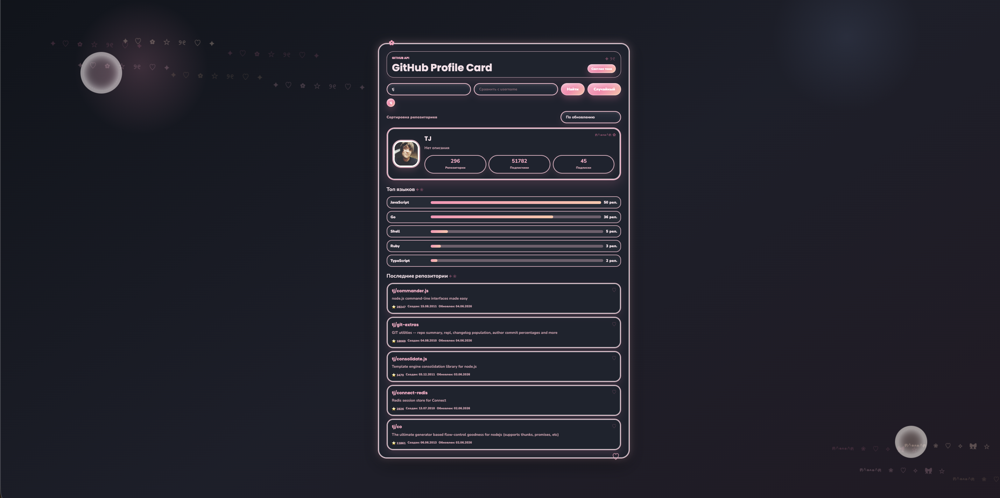

# GitHub Profile Card

Небольшой проект на HTML, CSS и vanilla JavaScript. Приложение ищет пользователя GitHub по username, показывает карточку профиля и пять последних обновленных репозиториев.

## Технологии

- HTML
- CSS
- Vanilla JavaScript
- GitHub REST API

## Возможности

- Поиск по кнопке "Найти"
- Поиск по клавише Enter
- Состояние загрузки
- Обработка ошибки 404: "Пользователь не найден"
- Адаптивная карточка профиля

## Скриншот

Добавьте сюда скриншот проекта:

## Запуск локально

Откройте файл `index.html` в браузере.

